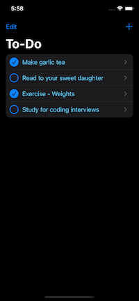
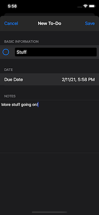
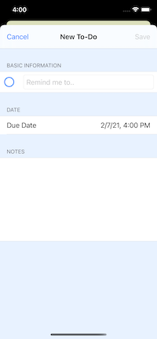
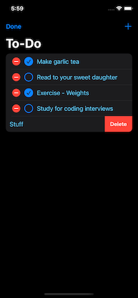
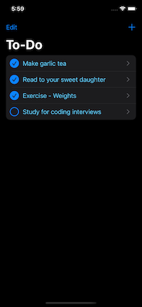
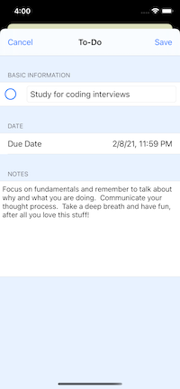

# ToDo
iOS App: Notes: store notes, due date, track completion, and save / edit changes all in one place.

## Built with:
* Swift
* UIKit
* File Manager
* MVC
* Storyboards

## Disclaimer
This is my own implementation of a todo list, no tutorial or the like was followed.
